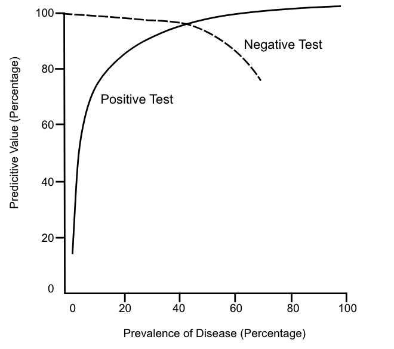

---
output:
  pdf_document: default
  html_document: default
---
## Question 1: Sensitivity – Specificity 

You are working in a pediatric clinic with an experienced pediatrician. You examine 50 children whose parents are concerned about the possibility of ear infection. You believe that 15 children have red and bulging tympanic membranes consistent with otitis media (OM). The pediatrician examines these same children and makes a diagnosis of otitis media in 25 children. The pediatrician agrees that 10 of your 15 diagnoses of children with otitis media are correct. Fill in the 2x2 table below.

|                         | Pediatrician (gold standard) |       |       |       | Total |
|-------------------------|------------------------------|-------|-------|-------|-------|
|                         | Otitis Media (+)             | No Otitis Media (-) |       |       |       |
| Physical Examination    |                              |       |       |       |       |
| Otitis Media (+)        |             10               |    5   |       |       |    15   |
| No Otitis Media (-)     |             15               |    20   |       |       |   35   |
| Total                   |             25               |    25   |       |       |   50    |

### Question 1.1: Calculate and interpret the sensitivity of your examination. 
- Sensitivity of your exam = 10/25 = 40%
- Your examination was able to detect 40% of the patients with otitis media

### Question 1.2: Calculate and interpret the specificity of your examination. 
- Specificity = 20/25 = 80%
- Your examination detected 80% of the patients with normal eardrums (patients without otitis media).

### Question 1.3: Calculate and interpret the chance that your diagnosis of Otitis Media is correct (PPV). 
- PPV = 10/15 = 67%
- Patients who you thought had otitis media had a 67% chance of having otitis media when the pediatrician examined them.

### Question 1.4: Calculate and interpret the chance that your diagnosis of normal eardrum is correct (NPV). 
- NPV = 20/35 = 57%
- Patients who you thought had normal eardrums had a 57% chance of having normal eardrums confirmed by the pediatrician.

## Question 2: Sensitivity – Specificity 

You are provided with a sensitivity and specificity table for a new very quick and easy nasal swab to detect type 2 diabetes. 100 people are tested for the disease with the gold standard measure and the new nasal swab measure. According to the gold standard measure, 15 people have the disease; 85 people are not diseased. The new swab-based measure suggests that 10 people have diabetes and 45 people do not have diabetes. Construct the 2x2 table for this example.

|                         |  Gold standard) |       |       |       | Total |
|-------------------------|------------------------------|-------|-------|-------|-------|
|                         | Diabetes (+)             | No Diabetes (-) |       |       |       |
| Swab based method    |                              |       |       |       |       |
| Diabetes (+)        |             10               |    45   |       |       |    55   |
| No Diabetes (-)     |             5               |    40   |       |       |   45   |
| Total                   |             15               |    85   |       |       |   100    |

### Question 2.1: Calculate and interpret the sensitivity of your examination. 
- Sensitivity: A/(A + C) × 100
  - 10/15 × 100 = 67%
- Sensitivity is two-thirds, so the test is able to detect two-thirds of the people with the disease. The test misses one-third of the people who have the disease.

### Question 2.2: Calculate and interpret the specificity of your examination. 
- Specificity: D/(D + B) × 100
  - 45/85 × 100 = 53%
- The test has 53% specificity. In other words, out of 85 persons without the disease, 45 have true negative results while 40 individuals test positive for a disease that they do not have.

### Question 2.3: Calculate and interpret the chance that the swab-based diagnosis of diabetes is correct (PPV). 
- Positive Predictive Value: A/(A + B) × 100
  - 10/50 × 100 = 20%
- The sensitivity and specificity are characteristics of this test. For a clinician, however, the important fact is among the people who test positive, only 20% actually have the disease.

### Question 2.4: Calculate and interpret the chance that the swab-based diagnosis of diabetes is correct (NPV). 
- Negative Predictive Value: D/(D + C) × 100
  - 45/50 × 100 = 90%
- Of those that test negative, 90% do not have the disease.

## Question 3: Sensitivity – Specificity

This time we use the same test as in Question 2, but in a different population, with a disease prevalence of 30%.
- Prevalence of Disease: 30/100 × 100 = 30%

We maintain the same sensitivity and specificity because these are characteristics of this test.
- Sensitivity: A/(A + C) × 100
  - 20/30 × 100 = 67%
- Specificity: D/(D + B) × 100
  - 37/70 × 100 = 53%

### Question 3.1: Calculate the PVV and NPV for the same test with a high prevalence. Interpret changes in the PVV and NPV comparing questions 2.3 and 2.4 to this answers you get in answering this question.
- Positive Predictive Value: A/(A + B) × 100
  - 20/53 × 100 = 38%
- Negative Predictive Value: D/(D + C) × 100
  - 37/47 × 100 = 79%

Using the same test in a population with a higher prevalence increases positive predictive value. Conversely, increased prevalence results in decreased negative predictive value. When considering predictive values of diagnostic or screening tests, recognize the influence of the prevalence of the disease. The figure below depicts the relationship between disease prevalence and predictive value in a test with 95% sensitivity and 95% specificity. 

